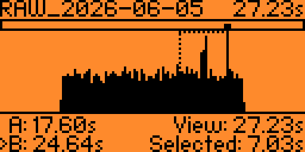
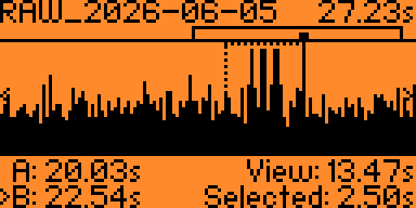
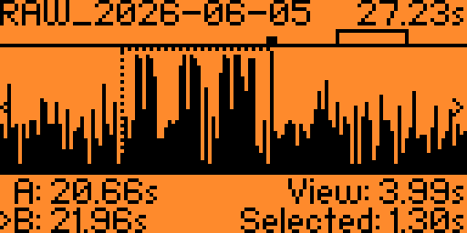
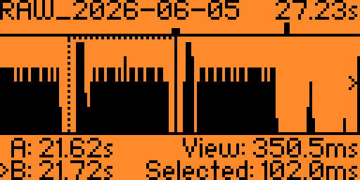
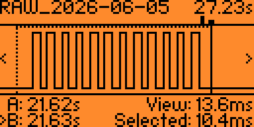
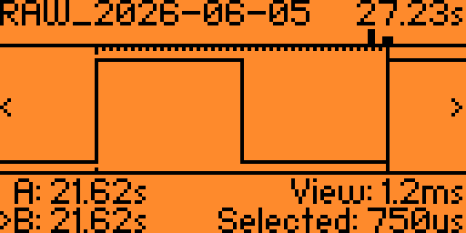
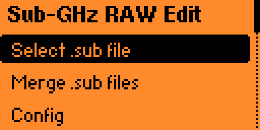
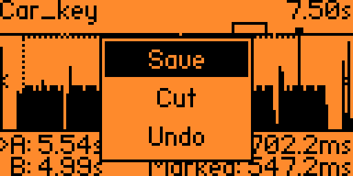
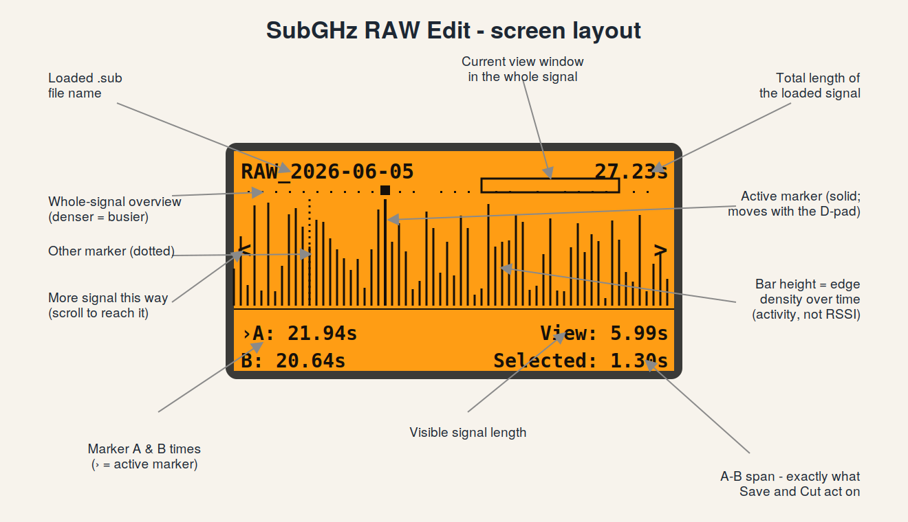

https://github.com/user-attachments/assets/16b59c75-5fc2-4f3a-b325-f7fb1d623210

# Sub-GHz .sub RAW Files Editor for Flipper Zero

A tiny on-device waveform editor for **Flipper Zero** that trims RAW `.sub`
captures down to just the part you care about. Open a recording, let the app
find the actual signal hiding inside a long stretch of silence, slide two
markers to the start and end of one clean frame, and save it as a new `.sub` -
or cut an unwanted stretch out of the middle and keep editing.

Built for cleaning up `Read RAW` captures before decoding or replaying them -
a long recording full of repeats and noise becomes a single tidy frame.

> **Receive/analysis only.** This app never transmits. It only reads, displays
> and rewrites files you already have on the SD card.

## Supported protocols
Sub-GHz-RAW-Edit allows you to view RAW signals and any other `.sub` protocols supported by your firmware. For all protocols other than RAW capture, this app uses the device's internal decoder.

As the `Save` option always writes output `.sub` files in `RAW` format,
its able to transform already recognized signals (protocols) back to `RAW` again.

## Screenshots

Zooming from the full activity envelope all the way down to individual pulses,
then a trimmed single frame decoding cleanly as the original remote:

| Envelope (zoomed out) | Signal within AM650 noise | Signal zoom |
|:---:|:---:|:---:|
|  |  |  |

| Single signal frame | KeeLoq preambule waveform | Single waveform edge |
|:---:|:---:|:---:|
|  |  |  |

## Why

`Read RAW` on the Flipper records a continuous stream of pulse/gap durations. A
single button press on a remote often lands in the middle of seconds of
silence, repeated frames, and background noise. Most decoders work best on one
clean copy of the frame. Trimming that by hand means editing the `.sub` text
file on a computer and guessing where the signal starts. This app does it
visually, on the device.

## Features

- **Auto-locates the signal.** On open it scans the whole capture, finds the
  longest clean burst (the most complete frame copy) and jumps the view there
  with the A/B markers already placed around it - no scrolling through empty
  space.
- **Two view modes, switched automatically by zoom:**
  - *Envelope* when zoomed out - bar height shows signal activity, so you can
    see at a glance where the bursts are. Note that the Y axis is edge density,
    not amplitude.
  - *Real square wave* when zoomed in past ~30 ms - inspect individual pulses
    to place cuts precisely.
- **Overview strip** along the top shows the whole recording with a bracket
  marking where your current zoomed view sits.
- **Zoom out past the edges** of the data, so a short burst is shown with empty
  margins on both sides (a clean "silence -> frame -> silence" picture).
- **Trim, cut or undo.** Hold **OK** to open a small action menu:
  - *Save* writes just the A..B selection to a new `.sub` file, and lets you
    edit the suggested name first.
  - *Cut* removes everything between the markers from the in-RAM working copy
    and joins the two sides back together, so you can delete a noisy stretch or
    an unwanted frame and keep editing. Nothing is written to the card until you
    Save.
  - *Undo* reverts the last cut. It is greyed out (struck through) when there is
    nothing to undo.
- **Memory-safe.** Long silence gaps are clamped to fit a compact `int16`
  buffer, the buffer grows in small chunks and shrinks to the file's real size
  after loading. If there genuinely isn't enough free RAM, you get a clear
  "reboot and try again" message instead of a crash.
- **Clean output.** The saved frame is aligned to start on a pulse and end on a
  gap, with the original `Frequency` and `Preset` preserved.
  There is also an option to auto normalize jitter quirks which makes the signal even more clean.
  
  Note:
  Some signal receivers will reject a signal if it's "too clean" due to a built-in security layer.
  This layer can flag the signal as possibly synthesized.

| Main menu | Action menu |
|:---:|:---:|
|  |  |

## Controls

| Button       | Action                                          |
|--------------|-------------------------------------------------|
| Left / Right | Move the active cut marker (hold = move faster) |
| Up / Down    | Zoom in / out (centered on the active marker)   |
| OK (short)   | Switch the active marker between **A** and **B**|
| OK (hold)    | Open the action menu (**Save / Cut / Undo**)    |
| Back         | Exit                                            |

In the action menu, **Up / Down** move between Save, Cut and Undo, **OK**
confirms the highlighted action and **Back** closes the menu without doing
anything.

The active marker is the one drawn as a solid line with a small box on top, and
marked with `>` in the bottom bar. The other marker is dotted.



## Build

Works with the official firmware, Momentum, Unleashed and other forks.

### With your firmware tree (fbt)

```bash
# copy the folder into the firmware sources
cp -r subghz_raw_edit <firmware>/applications_user/subghz_raw_edit

cd <firmware>
./fbt fap_subghz_raw_edit
# result: build/latest/.extapps/subghz_raw_edit.fap
```

Build it from the **same firmware tree** that's flashed on your Flipper,
otherwise you'll get an "Outdated app" / API mismatch error.

Build and run on a connected device in one step:

```bash
./fbt launch APPSRC=applications_user/subghz_raw_edit
```

### With ufbt (standalone, no firmware tree)

```bash
pip install --upgrade ufbt
ufbt update --channel=release        # or point at your fork's SDK
# from the subghz_raw_edit/ folder:
ufbt                                 # builds dist/subghz_raw_edit.fap
ufbt launch                          # builds + uploads + runs
```

### Manual install

Copy the built `subghz_raw_edit.fap` onto the SD card at `/ext/apps/Sub-GHz/` and
launch it from **Apps -> Sub-GHz** on the Flipper.

## Usage

1. Launch **Sub-GHz RAW Edit** from *Apps -> Sub-GHz*.
2. Pick a RAW `.sub` file from `/ext/subghz`.
3. The view opens centered on the detected frame. Zoom out (Down) to see the
   whole signal, zoom in (Up) to see individual pulses.
4. Place **A** at the start of one clean frame, press OK, place **B** at the
   end.
5. Hold **OK** to open the action menu and choose:
   - **Save** - a name is suggested (`<name>_edit1`, the next free `_edit2`,
     `_edit3`, ... so saves never overwrite an earlier one). Edit it if you
     like and confirm; the A..B selection is written to
     `/ext/subghz/<name>.sub`.
   - **Cut** - the stretch between A and B is removed from the working copy and
     the two sides are joined. Re-place the markers and Cut again to clean up
     further, or Save when you are happy. If a cut would leave nothing behind it
     is refused and rolled back.
   - **Undo** - revert the last cut.

## File format

Reads and writes the standard Flipper RAW format:

```
Filetype: Flipper SubGhz RAW File
Version: 1
Frequency: 433920000
Preset: FuriHalSubGhzPresetOok270Async
Protocol: RAW
RAW_Data: 257 -926 637 -526 ...
```

`Frequency` and `Preset` are carried over from the source file. Only the
`RAW_Data` durations between the A and B markers are written.

## Notes & limitations

- **`Read RAW` does not record silence.** It starts capturing at the first
  detected pulse and stops shortly after the last one, so the empty seconds
  before/after a button press never reach the file. The empty margins this app
  shows when fully zoomed out are drawn for context - they are not stored data.
- **No RSSI / signal strength.** The waveform here carries no power information.
  A `.sub` RAW file is only a list of pulse and gap *durations* - there is no
  amplitude or RSSI stored in the format at all. In the zoomed-out *envelope*
  view the Y axis is therefore **edge density** (how rapidly the signal is
  switching over time), not signal power, so a taller bar means "more activity
  here", not "stronger signal". The zoomed-in *square wave* view is likewise
  just the high/low timing, not a measured level.
- **Cut is memory-safe.** Cutting compacts the data in place and allocates
  nothing, so trimming or cutting a large region cannot run you out of memory.
  The only allocation is the single-level Undo snapshot, which is taken before a
  cut and gated on free RAM: if there isn't enough, the cut is declined with a
  "Low memory" message instead of going ahead, so you never lose the ability to
  undo and never crash mid-cut.
- Durations are clamped to +/-32 ms so the capture fits a compact buffer. This
  only ever touches inter-frame silence; the signal pulses themselves
  (hundreds of microseconds) are stored exactly.
- Up to ~24000 samples (about 47 KB) per file; larger captures are truncated
  rather than failing. A real frame is only a few hundred samples, so this is
  plenty in practice.
- **Undo is one level deep.** Only the most recent cut can be reverted; a second
  cut replaces the snapshot of the first.
- Note the two separate ceilings: ~35 minutes of time (microseconds in an int32_t)
  and ~24000 samples (signal edges). They're independent - noise hits the sample
  limit within seconds because it's a dense storm of edges,
  even though it's nowhere near the time limit; a real frame is only a few hundred edges.
  The buffer holds ~24000 samples (signal edges) ≈ 47 KB of RAM — plenty for any
  real frame (a few hundred edges), but noise fills it in seconds. For example, an
  `AM650` capture at `433.92` MHz in a noisy area hits the limit around a ~105 KB
  25–30 s file. If you want to load longer RAWs just use `AM270` which won't
  make that much noise.
- To decode any `.sub` protocol other than RAW Capture, this application relies on the device's internal decoder.
  Therefore, for any recognized rolling protocols, it decodes the next keyframe, rather than the current one.
