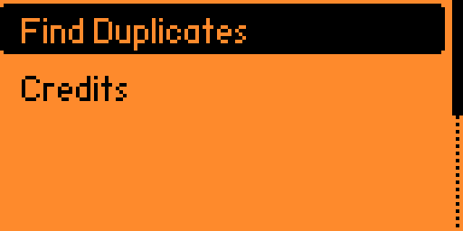
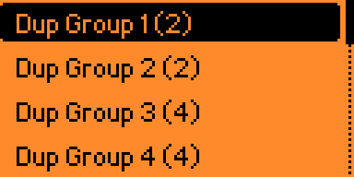
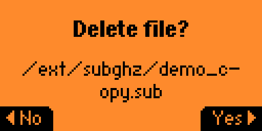

# Sub-GHz Duplicate Finder for Flipper Zero

An application for Flipper Zero to identify, manage, and clean up duplicate `*.sub` files from Sub-GHz storage.

## Screenshots

| Main Menu | Groups View | File Management |
| :---: | :---: | :---: |
|  |  |  |

> *Tip: Capture these screenshots using the "Remote" tab in qFlipper.*

## Development Setup

This project uses a standard `Makefile` for local development on your host machine (Linux/macOS).

### Requirements

- `gcc`, `make`, `clang-format`, `cppcheck`.

### Commands

- `make test`: Run unit tests for the core logic on your computer.
- `make format`: Automatically format code using `clang-format`.
- `make linter`: Run static analysis with `cppcheck` to ensure code safety.
- `make prepare`: Links your local project directory into the Flipper Zero firmware `applications_user` folder.
- `make fap`: Builds the `.fap` binary using `fbt` (requires firmware repo).
- `make clean`: Cleans local build artifacts.

## Building for Flipper Zero

1. Clone the official [Flipper Zero Firmware](https://github.com/flipperdevices/flipperzero-firmware).
2. Set the `FLIPPER_FIRMWARE_PATH` in your `Makefile` to point to your local firmware directory.
3. Run `make fap` from this project's directory. This command will:
   - Prepare the source code (symlink).
   - Clean previous builds.
   - Compile the binary using `fbt`.

## Project Structure

| File | Responsibility |
| --- | --- |
| `logic.h` / `logic.c` | Pure domain logic: CRC32, duplicate detection, record removal. No Flipper SDK dependency, testable with plain `gcc`. |
| `app_state.h` | App state struct, view enums, shared constants (`SCAN_DIR`, `FULL_PATH_LEN`). |
| `storage_helper.h` / `.c` | File I/O: directory scanning, file hashing, file deletion. |
| `ui.h` / `ui.c` | UI callbacks, rendering, view setup. |
| `main.c` | App lifecycle orchestration: alloc, setup, run, free. |
| `version.h` | App version, auto-updated by release-please. |

## CI/CD

This project includes GitHub Actions workflows:

- **CI** (`ci.yml`): Runs on every push and pull request.
  1. Linter (static analysis with `cppcheck`).
  2. Format check (style enforcement with `clang-format`).
  3. Unit tests (logic validation).

- **Release** (`release.yml`): Runs on push to `main`.
  1. Runs CI checks.
  2. [release-please](https://github.com/googleapis/release-please-action) creates a release PR with auto-generated changelog.
  3. On release, builds the `.fap` binary with `ufbt` and uploads it as a GitHub Release asset.

## Credits
Author: Endika
GitHub: [github.com/endika/flipper-sub-dup](https://github.com/endika/flipper-sub-dup)
